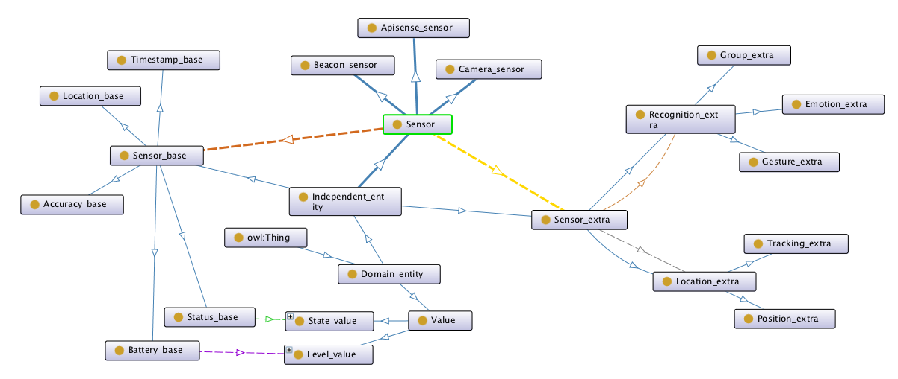

# Sensors Ontologies

This ontology describe the sensors ontology relative to the FUI Project [StoreConnect](https://github.com/StoreConnect).

## Definition
[Wikipedia](https://fr.wikipedia.org/wiki/Ontologie_(informatique)) defines an ontology as follows:
> "In computer science and information science, an ontology is a formal naming and definition of the types, properties, and interrelationships of the entities that really or fundamentally exist for a particular domain of discourse. It is thus a practical application of philosophical ontology, with a taxonomy.
> An ontology compartmentalizes the variables needed for some set of computations and establishes the relationships between them.
> Contemporary ontologies share many structural similarities, regardless of the language in which they are expressed. As mentioned above, most ontologies describe individuals (instances), classes (concepts), attributes, and relations. In this section each of these components is discussed in turn.
>
> Common [components of ontologies](https://en.wikipedia.org/wiki/Ontology_components) include:
> <dl>
> <dt>Individuals</dt>
> <dd>Instances or objects (the basic or "ground level" objects)</dd>
> <dt>Classes</dt>
> <dd>Sets, collections, concepts, classes in programming, types of objects, or kinds of things</dd>
> <dt>Attributes</dt>
> <dd>Aspects, properties, features, characteristics, or parameters that objects (and classes) can have</dd>
> <dt>Relations</dt>
> <dd>Ways in which classes and individuals can be related to one another</dd>
> <dt>Function terms</dt>
> <dd>Complex structures formed from certain relations that can be used in place of an individual term in a statement</dd>
> <dt>Restrictions</dt>
> <dd>Formally stated descriptions of what must be true in order for some assertion to be accepted as input</dd>
> <dt>Rules</dt>
> <dd>Statements in the form of an if-then (antecedent-consequent) sentence that describe the logical inferences that can be drawn from an assertion in a particular form</dd>
> <dt>Axioms</dt>
> <dd>Assertions (including rules) in a logical form that together comprise the overall theory that the ontology describes in its domain of application. This definition differs from that of "axioms" in generative grammar and formal logic. In those disciplines, axioms include only statements asserted as a priori knowledge. As used here, "axioms" also include the theory derived from axiomatic statements</dd>
> <dt>Events</dt>
> <dd>The changing of attributes or relations</dd>
> </dl>
> Ontologies are commonly encoded using ontology languages."

These ontology languages include [RDF Schema (RDFS)](https://en.wikipedia.org/wiki/RDF_Schema) and [Web Ontology Language (OWL)](https://en.wikipedia.org/wiki/Web_Ontology_Language).

Other definitions
- [Qu'est-ce qu'une ontologie ?](http://www.journaldunet.com/developpeur/tutoriel/theo/070403-ontologie.shtml) - Journal du Net
- [Ontology Development 101: A Guide to Creating Your First Ontology](http://protege.stanford.edu/publications/ontology_development/ontology101.pdf) - Stanford

## Ontology
The StoreConnect sensor ontologies is composed of the following core classes:

__Sensor__
It's the key node of our ontology. Every available sensor is a `Sensor`. From this node, we can access all properties.</dd>

__Sensor_base__
This node gives access to all the basic properties common to every sensors such as, `battery level`, `current time`, `physical position` etc. Those properties goal is to tag data pushed by sensors or simply control / configure them. Example:

__Sensor_extra__
Contains specifics capacities of sensors, some may have `location`, some `recognition` and others none of them such as RFID.

- Recognition
Matches with the cameras, this node gives access to different concepts such as detecting some groups (size, gender..), some gestures (take, drop, focus on..) or some emotions (happy, neutral...)

- Location
Gives access to concepts such as user tracking..

### Data representation

We suggest using [JSON-LD](https://en.wikipedia.org/wiki/JSON-LD) as representation format. You can find an example [there](http://musicontology.com/docs/getting-started.html).

## How to contribute

You can contribute to this ontology using [Protégé](http://protege.stanford.edu/) and summit your request within a `pull request` 
following the [contributing](CONTRIBUTING.md) instructions. 

