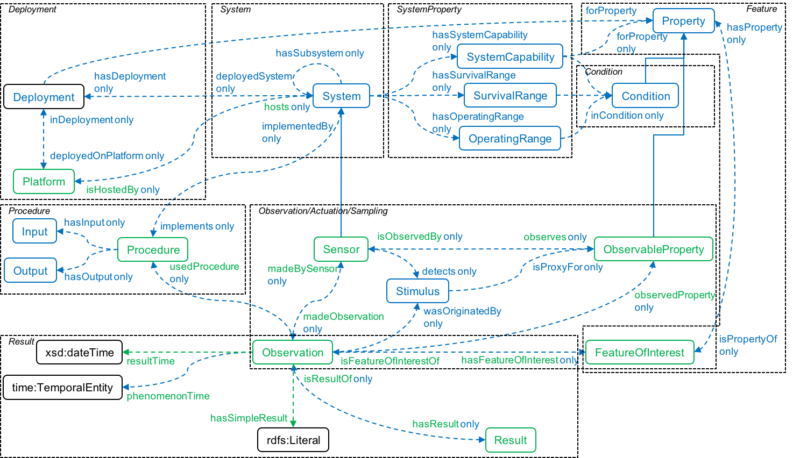

# FUI StoreConnect's main ontology

This ontology is the main ontology used to describe the [FUI StoreConnect project](https://www.pole-scs.org/projet/storeconnect).

In the rest of this document, the main FUI StoreConnect's ontology will be simple named the StoreConnect's ontology.

## Authors

Aurélien Bourdon, Julien Duribreux, [Romain Rouvoy](http://romain.rouvoy.fr), [Lionel Seinturier](http://www.lifl.fr/~seinturi).

## Version

1.0 

## Definition

### Imported concepts

The StoreConnect's ontology is based on several standard ontologies. A good understanding of these ontologies is strongly recommended to correctly understand the StoreConnect's one.

- The [OGC & W3C Semantic Sensor Network Ontology](https://www.w3.org/TR/vocab-ssn), by focusing on the [observation perspective](https://www.w3.org/TR/vocab-ssn/#fig-overview-of-the-ssn-classes-and-properties-observation-perspective)
- The [OGC GeoSPARQL Ontology](http://www.opengeospatial.org/standards/geosparql)
- (indirectly) The [OGC & W3C Time Ontology](https://www.w3.org/TR/owl-time/)

### Specific concepts

As described in the previous section, the StoreConnect's ontology is based on the [OGC & W3C Semantic Sensor Network Ontology](https://www.w3.org/TR/vocab-ssn). That's it, any StoreConnect's Sensor is a (or inherits from) [sosa:Sensor](https://www.w3.org/TR/vocab-ssn/#SOSASensor) (or more generally a [sosa:Platform](https://www.w3.org/TR/vocab-ssn/#SOSAPlatform) that hosts [sosa:Sensor](https://www.w3.org/TR/vocab-ssn/#SOSASensor)s) and StoreConnect's Sensor architecture is based on the specific [SSN/SOSA observation perspective](https://www.w3.org/TR/vocab-ssn/#fig-overview-of-the-ssn-classes-and-properties-observation-perspective). Details of this perspective is depicted by the following picture.



Based on this architecture, the StoreConnect's ontology can be represented as follows.


## Manipulation

### Visualization

There are four ways to visualize this ontology:

- By using its [dynamic representation](https://tinyurl.com/storeconnect-ontology-main) (use the [StoreConnect's dynamic visualization server](../../endpoints/dynamic-visualization-server).
- By using its [static representation](http://apiontologie.westeurope.cloudapp.azure.com:8080) (use the [StoreConnect's static visualization server](../../endpoints/static-visualization-server))
- By using the [Protégé](https://protege.stanford.edu/) tool and importing its associated [owl file](./storeconnect-main.owl)
- By using some Protégé's plugins, as the [Protege's OntoGraf plugin](https://protegewiki.stanford.edu/wiki/OntoGraf) and generate the associated image as defined in the [previous section](#specific-concepts)

#### Special note about the Protege's Ontograf plugin DOT generation

As explained above, when using [Protégé](https://protege.stanford.edu/), it is also possible to visualize ontology as a graph, by using the [Protege's OntoGraf plugin](https://protegewiki.stanford.edu/wiki/OntoGraf).
This plugin can also generate a [DOT](https://graphviz.gitlab.io/_pages/doc/info/lang.html) file of the ontology that can be further rendered as an image (see [StoreConnect's ontology picture](#specific-concepts)).
However, this generation is very limited and cannot be configured.

To configure and then _enhance_ this generation, you can use the [enhance-dot-ontograf tool](../../tools/dot-ontograf-enhancer). For instance, the [StoreConnect's ontology picture](#specific-concepts) has been generated by using the following command:

```
    ./enhance-dot-ontograf.sh 
        -o ./resources/storeconnect.dot
        -e Platform
        -e Sensor 
        -e Result 
        -e "'Feature Of Interest'" 
        -e "'Observable Property'" 
        -e Point 
        -e owl:Thing
        <path/to/the/original/storeconnect.dot> 
```

Where `<path/to/the/original/storeconnect.dot>` is the path to the original [Protege's OntoGraf plugin](https://protegewiki.stanford.edu/wiki/OntoGraf) [DOT](https://graphviz.gitlab.io/_pages/doc/info/lang.html) file

### Querying

More information about ontology querying can be found in the [endpoints/query-server](../../endpoints/query-server) part.

### Examples of use

This section shows some examples to use the StoreConnect's ontology

#### Example #1: Describe a simple observation made a camera sensor inside a store

The following example describes how to:

- Declare a new camera sensor (more precisely, a camera `sosa:Platform` that hosts a video tracker `sosa:Sensor`)
- Register an observation of this camera sensor, that focuses on a motion of an object in a given store

```ttl
@prefix rdf:  <http://www.w3.org/1999/02/22-rdf-syntax-ns#> .
@prefix rdfs: <http://www.w3.org/2000/01/rdf-schema#>.
@prefix xsd:  <http://www.w3.org/2001/XMLSchema#> .
@prefix sosa: <http://www.w3.org/ns/sosa/> .
@prefix time: <http://www.w3.org/2006/time#> .
@prefix geo: <http://www.opengis.net/ont/geosparql#> .
@prefix sc: <http://storeconnect/> .
@base <http://example.org/data/> .

# Motion observation is made from within a given store

<Store/1234> rdf:type sc:Store ;
    rdfs:label "The specific '1234' Store from within a move can be observed"@en .

# A camera can be seen as a sc:Camera sosa:Platform that hosts a sc:VideoTracker sosa:Sensor to track motion events

<Camera/4567> rdf:type sc:Camera ;
    rdfs:label "Camera - 4567"@en ;
    rdfs:comment "Camera - @Id=4567"@en ;
    sosa:hosts <videoTracker/7890> .

<VideoTracker/7890> a sc:VideoTracker ;
    rdfs:label "Video Tracker"@en ;
    sosa:observes sc:Motion .

# An observation made by the videoTracker/7890 sc:VideoTracker.

<Observation/1234> rdf:type sosa:Observation ;
    sosa:observedProperty sc:Motion ;
    sosa:hasFeatureOfInterest  <Store/1234> ;
    sosa:madeBySensor <VideoTracker/7890> ;
    sosa:hasResult [
        rdf:type sc:MotionEvent ;
        sc:hasMotionSubject [
            rdf:type sc:MotionSubject
        ];
        sc:hasMotionState [
            rdf:type sc:Walking
        ];
        sc:hasOrientation [
            rdf:type sc:Orientation ;
            sc:orientation "124.923"^^xsd:float ;
            sc:accuracy "0.87"^^xsd:float
        ];
        sc:hasSpeed [
            rdf:type sc:Orientation ;
            sc:speed "2.78"^^xsd:float ;
            sc:accuracy "0.98"^^xsd:float
        ];
        sc:hasLocation [
            rdf:type sc:Location ;
            sc:floor "1"^^xsd:float ;
            sc:hasPoint [
                rdf:type geo:Point ;
                geo:asWKT "POINT(45.99239 76.85746)"^^geo:wktLiteral
            ]
        ]
    ];
    sosa:resultTime [
        rdf:type time:Instant ;
        time:inXSDDateTimeStamp "2017-06-06T12:36:13+00:00"^^xsd:dateTimeStamp 
    ] .
```

#### Example #2: Retrieve any motion event observation and its associated motion subject and location coordinates

Based on the first example, retrieve any motion event observation and its associated motion subject and location coordinates could be done by executing the following [SPARQL](https://www.w3.org/TR/sparql11-query/) query:

```sparql
PREFIX sosa: <http://www.w3.org/ns/sosa/>
PREFIX geo: <http://www.opengis.net/ont/geosparql#>
PREFIX sc: <http://storeconnect/>

SELECT DISTINCT ?observation ?subject ?coordinates
WHERE {
  # Give all sc:MotionEvent observations
  ?observation a sosa:Observation .
  ?observation sosa:hasResult ?result .
  ?result a sc:MotionEvent .

  # And retrieve from them their motion subject and associated location coordinates
  ?result sc:hasMotionSubject ?subject .
  ?result sc:hasLocation ?location .
  ?location sc:hasPoint ?point .
  ?point geo:asWKT ?coordinates .
}
```

And could then provide the following result:


#### Example #3: Create similarity between two objects

To express that two objects are similar, you can use the `sc:Similarity` concept.

For instance, the following statements define that two motion subjects (`sc:MotionSubject`) are similar:

 ```ttl
 @prefix rdf:  <http://www.w3.org/1999/02/22-rdf-syntax-ns#> .
 @prefix xsd:  <http://www.w3.org/2001/XMLSchema#> .
 @prefix sc: <http://storeconnect/> .
 @base <http://example.org/data/> .
 
 # Lets define our two sc:MotionSubject
 <MotionSubject/1234> rdf:type sc:MotionSubject .
 <MotionSubject/5678> rdf:type sc:MotionSubject .
 
 # Now make them similar at 85%
 <MotionSubject/1234> sc:hasSimilarity [
    rdf:type sc:Similarity ;
    sc:isSimilarWith <MotionSubject/5678> ;
    sc:accuracy "85.0"^^xsd:float
 ] .
 ```
 
#### Example #4: Retrieve any similar object to a given one

Now, based on the previous example, lets say we want to have all similar motion subjects to our `<MotionSubject/1234>` one. This could be expressed as the following [SPARQL](https://www.w3.org/TR/sparql11-query/) query:

```sparql
BASE <http://example.org/data/>
PREFIX xsd: <http://www.w3.org/2001/XMLSchema#>
PREFIX sc: <http://storeconnect/>

SELECT DISTINCT ?similarSubject ?similarityWeight
WHERE {
  <MotionSubject/1234> sc:hasSimilarity ?similarity .
  ?similarity sc:isSimilarWith ?similarSubject .
  ?similarity sc:accuracy ?similarityWeight .
  FILTER (?similarityWeight > "75"^^xsd:int) . 
}

```

And then provide the following result:


